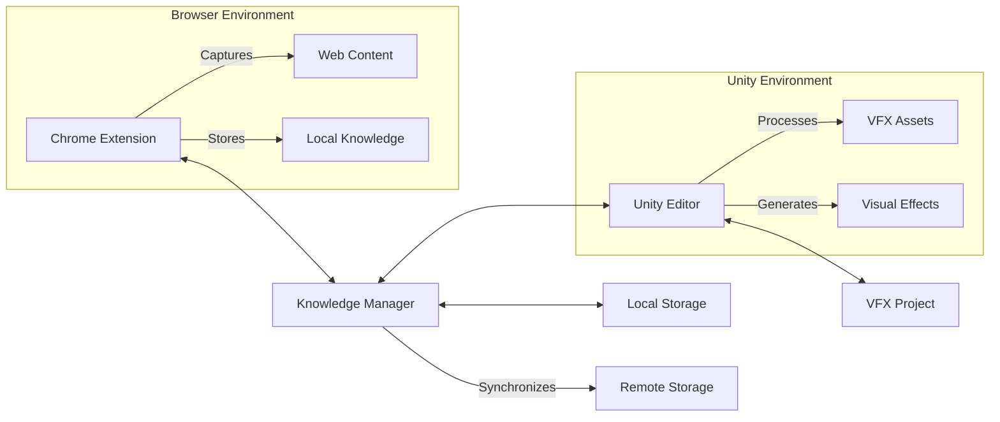

# Architecture Overview

## System Architecture

## Core Components

### 1. Knowledge Management System
- **KnowledgeManager.js**: Central knowledge storage and retrieval
- **Search Interface**: Fast, tag-based search with filters
- **Chrome Extension**: Browser integration for knowledge capture

### 2. VFX Pipeline
- **Asset Processing**: Import and optimization of VFX assets
- **Rendering Pipeline**: Custom shaders and materials
- **Performance Monitoring**: Real-time performance metrics

### 3. Automation Framework
- **SystemMonitor.cs**: Tracks system resources
- **AutomationManager.cs**: Handles automated tasks
- **Editor Tools**: Custom Unity editor extensions

## Data Flow

1. **Knowledge Capture**
   - User saves web content → Chrome Extension → Knowledge Manager
   - Content is indexed and stored with metadata

2. **VFX Processing**
   - Import assets → Process → Optimize → Integrate into project
   - Monitor performance and adjust settings

3. **Automation**
   - Monitor system metrics
   - Trigger optimizations when thresholds are exceeded
   - Log issues and suggest improvements

## Performance Considerations

### Memory Management
- **Web**: Implement virtual scrolling for large result sets
- **Unity**: Use object pooling and efficient garbage collection
- **Storage**: Implement data compression and cleanup routines

### Optimization Techniques
- **Code**: Use Burst Compiler for performance-critical sections
- **Rendering**: Implement LOD systems and occlusion culling
- **Networking**: Minimize data transfer and implement delta compression

## Security Model

### Data Protection
- Encrypt sensitive data at rest
- Implement secure authentication for remote services
- Regular security audits and dependency updates

### Access Control
- Role-based access control for knowledge management
- Audit trails for all data modifications
- Secure API endpoints with rate limiting

## Monitoring and Maintenance

### Logging
- Centralized logging system
- Real-time error tracking
- Performance metrics collection

### Maintenance
- Automated backups
- Regular dependency updates
- Performance optimization cycles

## Integration Points

### External Services
- **Version Control**: Git integration
- **CI/CD**: Automated testing and deployment
- **Monitoring**: Performance and error tracking

### APIs
- RESTful API for knowledge management
- WebSocket for real-time updates
- GraphQL for efficient data querying
