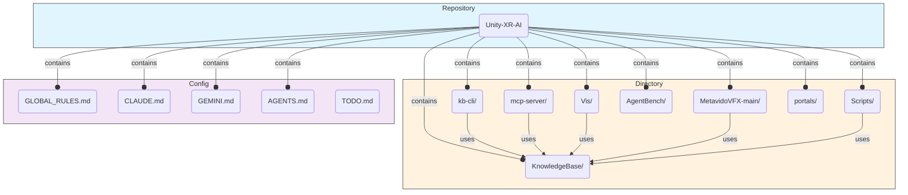
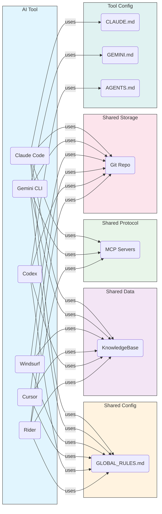
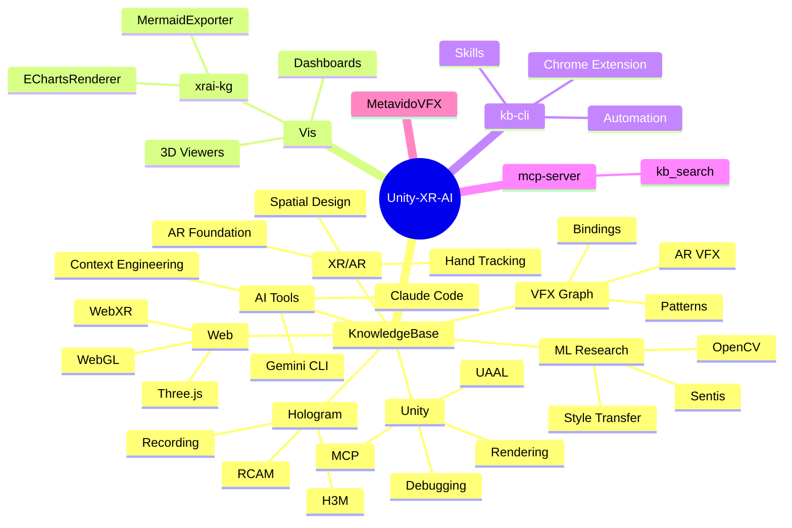

# KB Architecture Diagrams

> Auto-generated by xrai-kg MermaidExporter
> Run: `node scripts/generate-kb-diagrams.mjs`
> Last generated: 2026-02-12

---

## 1. Knowledge Domain Map

**25 entities, 37 relations**
13 knowledge domains with cross-references and key files.

```mermaid
flowchart TD

    subgraph Root["Root"]
        Unity_XR_AI_KB("Unity-XR-AI KB")
    end

    subgraph Domain["Domain"]
        AI_Tools("AI Tools")
        Unity_Core("Unity Core")
        VFX_Graph("VFX Graph")
        XR_AR("XR/AR")
        Hologram("Hologram")
        Web_Tech("Web Tech")
        MCP_Protocol("MCP Protocol")
        ML_Research("ML Research")
        Portals_Project("Portals Project")
        GitHub_Index("GitHub Index")
        Operations("Operations")
        Tool_Integration("Tool Integration")
        Visualization("Visualization")
    end

    subgraph File["File"]
        _CLAUDE_CODE_MASTER["_CLAUDE_CODE_MASTER"]
        _CLAUDE_CODE_BEST_PRACTICES["_CLAUDE_CODE_BEST_PRACTICES"]
        _ACE_CONTEXT_ENGINEERING["_ACE_CONTEXT_ENGINEERING"]
        _GEMINI_CLI_BEST_PRACTICES["_GEMINI_CLI_BEST_PRACTICES"]
        _UNITY_MCP_MASTER["_UNITY_MCP_MASTER"]
        _UNITY_DEBUGGING_MASTER["_UNITY_DEBUGGING_MASTER"]
        _UNITY_UAAL_MASTER["_UNITY_UAAL_MASTER"]
        _UNITY_RENDERING_MASTER["_UNITY_RENDERING_MASTER"]
        _VFX_MASTER_PATTERNS["_VFX_MASTER_PATTERNS"]
        _VFX_BINDINGS_MASTER["_VFX_BINDINGS_MASTER"]
        _VFX_AR_MASTER["_VFX_AR_MASTER"]
    end

    Unity_XR_AI_KB --o|contains| AI_Tools
    Unity_XR_AI_KB --o|contains| Unity_Core
    Unity_XR_AI_KB --o|contains| VFX_Graph
    Unity_XR_AI_KB --o|contains| XR_AR
    Unity_XR_AI_KB --o|contains| Hologram
    Unity_XR_AI_KB --o|contains| Web_Tech
    Unity_XR_AI_KB --o|contains| MCP_Protocol
    Unity_XR_AI_KB --o|contains| ML_Research
    Unity_XR_AI_KB --o|contains| Portals_Project
    Unity_XR_AI_KB --o|contains| GitHub_Index
    Unity_XR_AI_KB --o|contains| Operations
    Unity_XR_AI_KB --o|contains| Tool_Integration
    Unity_XR_AI_KB --o|contains| Visualization
    AI_Tools --o|contains| _CLAUDE_CODE_MASTER
    AI_Tools --o|contains| _CLAUDE_CODE_BEST_PRACTICES
    AI_Tools --o|contains| _ACE_CONTEXT_ENGINEERING
    AI_Tools --o|contains| _GEMINI_CLI_BEST_PRACTICES
    Unity_Core --o|contains| _UNITY_MCP_MASTER
    Unity_Core --o|contains| _UNITY_DEBUGGING_MASTER
    Unity_Core --o|contains| _UNITY_UAAL_MASTER
    Unity_Core --o|contains| _UNITY_RENDERING_MASTER
    VFX_Graph --o|contains| _VFX_MASTER_PATTERNS
    VFX_Graph --o|contains| _VFX_BINDINGS_MASTER
    VFX_Graph --o|contains| _VFX_AR_MASTER
    VFX_Graph -->|uses| XR_AR
    Hologram -->|uses| VFX_Graph
    Hologram -->|uses| XR_AR
    Unity_Core -->|uses| MCP_Protocol
    Portals_Project -.->|depends_on| Unity_Core
    Portals_Project -.->|depends_on| VFX_Graph
    Portals_Project -.->|depends_on| XR_AR
    AI_Tools -->|uses| MCP_Protocol
    Visualization -->|uses| Web_Tech
    ML_Research -->|uses| Unity_Core
    Web_Tech -->|uses| XR_AR
    Tool_Integration -->|uses| AI_Tools
    Operations -->|uses| AI_Tools

    style Root fill:#e1f5fe,stroke:#333
    style Domain fill:#fff3e0,stroke:#333
    style File fill:#f3e5f5,stroke:#333

```

---

## 2. Tooling Ecosystem

**22 entities, 17 relations**
CLI tools, automation, visualization, and MCP servers.

```mermaid
flowchart TD

    subgraph Tool["Tool"]
        kb_cli("kb-cli")
        kb_add("kb-add")
        kb_audit("kb-audit")
        kb_security_audit("kb-security-audit")
    end

    subgraph Library["Library"]
        xrai_kg("xrai-kg")
    end

    subgraph Component["Component"]
        Chrome_Extension("Chrome Extension")
        KnowledgeManager("KnowledgeManager")
        SuggestionEngine("SuggestionEngine")
        HistoryAnalyzer("HistoryAnalyzer")
        Skills("Skills")
    end

    subgraph Module["Module"]
        MermaidExporter("MermaidExporter")
        EChartsRenderer("EChartsRenderer")
    end

    subgraph Dashboard["Dashboard"]
        XRAI_Dashboard("XRAI Dashboard")
        KG_Dashboard("KG Dashboard")
    end

    subgraph Automation["Automation"]
        kb_health_check("kb-health-check")
        github_trends("github-trends")
        generate_kb_index("generate-kb-index")
        pattern_extractor("pattern-extractor")
    end

    subgraph Server["Server"]
        unity_xr_kb_MCP("unity-xr-kb MCP")
        CoPlay_MCP("CoPlay MCP")
    end

    subgraph File["File"]
        LEARNING_LOG["LEARNING_LOG"]
    end

    subgraph Directory["Directory"]
        KnowledgeBase("KnowledgeBase")
    end

    kb_cli --o|contains| Chrome_Extension
    kb_cli --o|contains| KnowledgeManager
    kb_cli --o|contains| SuggestionEngine
    kb_cli --o|contains| HistoryAnalyzer
    kb_cli --o|contains| Skills
    xrai_kg --o|contains| MermaidExporter
    xrai_kg --o|contains| EChartsRenderer
    XRAI_Dashboard -->|uses| xrai_kg
    KG_Dashboard -->|uses| EChartsRenderer
    kb_add -->|calls| LEARNING_LOG
    kb_audit -->|calls| KnowledgeBase
    kb_health_check -->|calls| KnowledgeBase
    generate_kb_index -->|calls| KnowledgeBase
    pattern_extractor -->|calls| LEARNING_LOG
    unity_xr_kb_MCP -->|calls| KnowledgeBase
    Chrome_Extension -->|uses| KnowledgeManager
    Chrome_Extension -->|uses| SuggestionEngine

    style Tool fill:#e1f5fe,stroke:#333
    style Library fill:#fff3e0,stroke:#333
    style Component fill:#f3e5f5,stroke:#333
    style Module fill:#e8f5e9,stroke:#333
    style Dashboard fill:#fce4ec,stroke:#333
    style Automation fill:#e0f2f1,stroke:#333
    style Server fill:#fff8e1,stroke:#333
    style File fill:#f1f8e9,stroke:#333
    style Directory fill:#e1f5fe,stroke:#333

```

---

## 3. Repository Structure

**14 entities, 17 relations**
Top-level directories and their relationships.

---

## 4. Cross-Tool Integration

**13 entities, 24 relations**
How 6 AI tools share knowledge through GLOBAL_RULES, KB, MCP, and Git.

---

## 5. Knowledge Mindmap

---

## Graph Statistics

| Graph | Entities | Relations | Types |
|-------|----------|-----------|-------|
| Knowledge Domains | 25 | 37 | 3 |
| Tooling Ecosystem | 22 | 17 | 9 |
| Repository Structure | 14 | 17 | 3 |
| Cross-Tool Integration | 13 | 24 | 6 |
