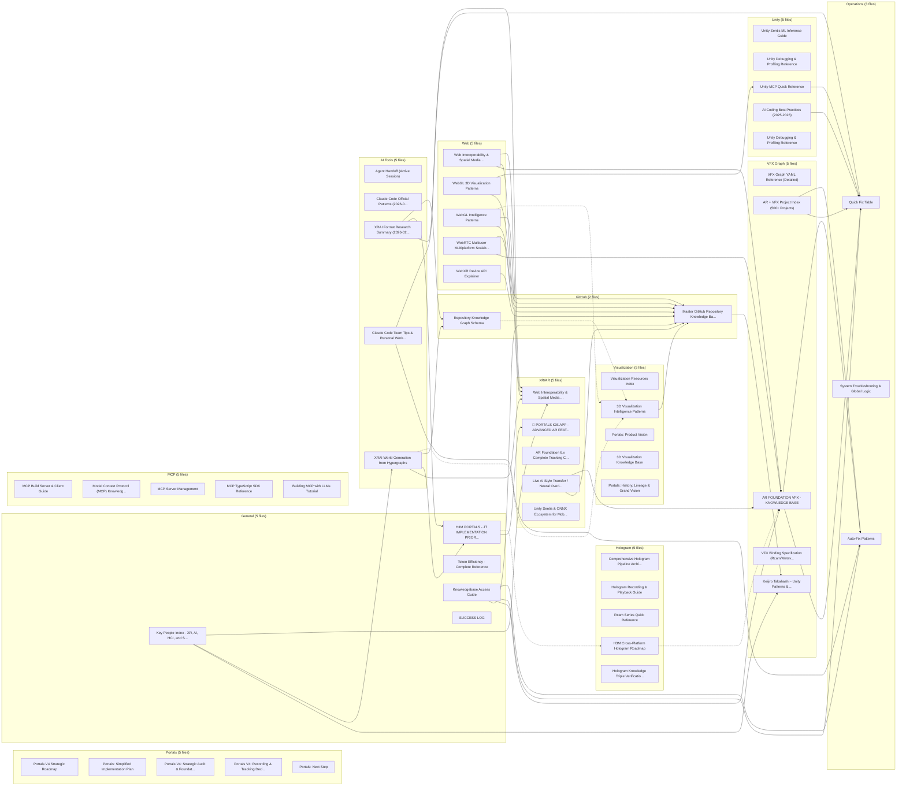

# KB Map

> Auto-generated by kb-viz-generate.mjs
> 2026-02-12 | 245 files | 604 connections

```mermaid
flowchart LR

    subgraph Web["Web (5 files)"]
        _web_master["Web Interoperability & Spatial Media ..."]
        _webgl_3d_visualization_patterns["WebGL 3D Visualization Patterns"]
        _webgl_intelligence_patterns["WebGL Intelligence Patterns"]
        _webrtc_multiuser_multiplatform_guide["WebRTC Multiuser Multiplatform Scalab..."]
        _webxr_device_api_explainer["WebXR Device API Explainer"]
    end

    subgraph XRAR["XR/AR (5 files)"]
        _advanced_ar_features_implementation_plan["🎨 PORTALS iOS APP - ADVANCED AR FEAT..."]
        _web_interoperability_standards["Web Interoperability & Spatial Media ..."]
        _xr_capabilities_master["AR Foundation 6.x Complete Tracking C..."]
        _ml_research_master["Live AI Style Transfer / Neural Overl..."]
        _unity_sentis_onnx_mobile_xr_research_2026["Unity Sentis & ONNX Ecosystem for Mob..."]
    end

    subgraph VFXGraph["VFX Graph (5 files)"]
        _vfx_master_patterns["VFX Graph YAML Reference (Detailed)"]
        _vfx_ar_master["AR + VFX Project Index (500+ Projects)"]
        _keijiro_metavido_vfx_research["Keijiro Takahashi - Unity Patterns & ..."]
        _vfx_bindings_master["VFX Binding Specification (Rcam/Metav..."]
        _arfoundation_vfx_knowledge_base["AR FOUNDATION VFX - KNOWLEDGE BASE"]
    end

    subgraph Hologram["Hologram (5 files)"]
        _hologram_master["Comprehensive Hologram Pipeline Archi..."]
        _hologram_recording_playback["Hologram Recording & Playback Guide"]
        _rcam_master["Rcam Series Quick Reference"]
        _h3m_hologram_roadmap["H3M Cross-Platform Hologram Roadmap"]
        _hologram_verification_2026_01_15["Hologram Knowledge Triple Verificatio..."]
    end

    subgraph Portals["Portals (5 files)"]
        _portals_v4_strategic_roadmap["Portals V4 Strategic Roadmap"]
        _portals_simplified_plan["Portals: Simplified Implementation Plan"]
        _portals_v4_strategic_audit_2026_02["Portals V4: Strategic Audit & Foundat..."]
        _portals_v4_recording_and_tracking["Portals V4: Recording & Tracking Deci..."]
        _portals_next_step["Portals: Next Step"]
    end

    subgraph General["General (5 files)"]
        _jt_priorities["H3M PORTALS - JT IMPLEMENTATION PRIOR..."]
        _token_efficiency_complete["Token Efficiency - Complete Reference"]
        _kb_meta["Knowledgebase Access Guide"]
        success_log["SUCCESS LOG"]
        _key_people_index["Key People Index - XR, AI, HCI, and S..."]
    end

    subgraph GitHub["GitHub (2 files)"]
        _master_github_repo_knowledgebase["Master GitHub Repository Knowledge Ba..."]
        _repo_graph_schema["Repository Knowledge Graph Schema"]
    end

    subgraph AITools["AI Tools (5 files)"]
        _agent_handoff["Agent Handoff (Active Session)"]
        _claude_code_official_patterns_2026["Claude Code Official Patterns (2026-0..."]
        _xrai_master["XRAI Format Research Summary (2026-02..."]
        _claude_code_team_tips_boris_cherny["Claude Code Team Tips & Personal Work..."]
        _xrai_hypergraph_world_generation["XRAI World Generation from Hypergraphs"]
    end

    subgraph Unity["Unity (5 files)"]
        _unity_ml_master["Unity Sentis ML Inference Guide"]
        _unity_debugging_master["Unity Debugging & Profiling Reference"]
        _unity_mcp_master["Unity MCP Quick Reference"]
        _ai_coding_best_practices["AI Coding Best Practices (2025-2026)"]
        _unity_debugging_reference["Unity Debugging & Profiling Reference"]
    end

    subgraph Visualization["Visualization (5 files)"]
        _visualization_resources_index["Visualization Resources Index"]
        _3dvis_intelligence_patterns["3D Visualization Intelligence Patterns"]
        _portals_product_vision["Portals: Product Vision"]
        _3d_visualization_knowledgebase["3D Visualization Knowledge Base"]
        _portals_history_and_vision["Portals: History, Lineage & Grand Vision"]
    end

    subgraph MCP["MCP (5 files)"]
        _mcp_build_server_client["MCP Build Server & Client Guide"]
        _mcp_model_context_protocol["Model Context Protocol (MCP) Knowledg..."]
        _mcp_server_management["MCP Server Management"]
        _mcp_typescript_sdk["MCP TypeScript SDK Reference"]
        _building_mcp_with_llms["Building MCP with LLMs Tutorial"]
    end

    subgraph Operations["Operations (3 files)"]
        _quick_fix["Quick Fix Table"]
        troubleshooting_and_logic["System Troubleshooting & Global Logic"]
        _auto_fix_patterns["Auto-Fix Patterns"]
    end

    _webgl_intelligence_patterns -..-> _3dvis_intelligence_patterns
    _repo_graph_schema -..-> _3dvis_intelligence_patterns
    _jt_priorities -..-> _h3m_hologram_roadmap
    _h3m_hologram_roadmap -..-> _arfoundation_vfx_knowledge_base
    _xrai_hypergraph_world_generation -..-> _3dvis_intelligence_patterns
    _web_master --> _web_interoperability_standards
    _web_master --> _master_github_repo_knowledgebase
    _web_master --> _arfoundation_vfx_knowledge_base
    _vfx_ar_master --> _auto_fix_patterns
    _vfx_ar_master --> _quick_fix
    _jt_priorities --> _advanced_ar_features_implementation_plan
    _master_github_repo_knowledgebase --> _keijiro_metavido_vfx_research
    _kb_meta --> _auto_fix_patterns
    _kb_meta --> _quick_fix
    _kb_meta --> _arfoundation_vfx_knowledge_base
    _kb_meta --> _master_github_repo_knowledgebase
    _arfoundation_vfx_knowledge_base --> _auto_fix_patterns
    _arfoundation_vfx_knowledge_base --> _quick_fix
    _ml_research_master --> _arfoundation_vfx_knowledge_base
    _ml_research_master --> _master_github_repo_knowledgebase
    _xrai_master --> _repo_graph_schema
    _xrai_master --> _jt_priorities
    _xrai_master --> _web_interoperability_standards
    _unity_mcp_master --> _quick_fix
    _ai_coding_best_practices --> _quick_fix
    _claude_code_team_tips_boris_cherny --> _quick_fix
    _claude_code_team_tips_boris_cherny --> _auto_fix_patterns
    _xrai_hypergraph_world_generation --> _repo_graph_schema
    _xrai_hypergraph_world_generation --> _jt_priorities
    _xrai_hypergraph_world_generation --> _web_interoperability_standards
    _3dvis_intelligence_patterns --> _master_github_repo_knowledgebase
    _key_people_index --> _web_interoperability_standards
    _key_people_index --> _xrai_hypergraph_world_generation
    _key_people_index --> _keijiro_metavido_vfx_research
    _webgl_3d_visualization_patterns --> _unity_mcp_master
    _webgl_3d_visualization_patterns --> _master_github_repo_knowledgebase
    _webgl_intelligence_patterns --> _web_interoperability_standards
    _webgl_intelligence_patterns --> _master_github_repo_knowledgebase
    _webrtc_multiuser_multiplatform_guide --> _master_github_repo_knowledgebase
    _webrtc_multiuser_multiplatform_guide --> _arfoundation_vfx_knowledge_base
    _webxr_device_api_explainer --> _master_github_repo_knowledgebase
```
