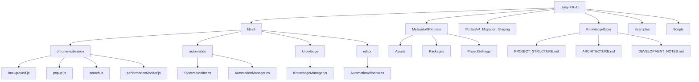

# Unity XR AI - Project Structure

## Key Components

### 1. Knowledge Base CLI (`kb-cli/`)
- **Chrome Extension**: Browser integration for knowledge capture
- **Automation**: System monitoring and task automation
- **Knowledge Management**: Centralized knowledge storage and retrieval
- **Editor Tools**: Unity editor integration

### 2. Metavido VFX (`MetavidoVFX-main/`)
- Core VFX project
- Asset management
- Project settings and configurations

### 3. Knowledge Base (`KnowledgeBase/`)
- Project documentation
- Architecture decisions
- Development notes
- Best practices

## Dependencies

### Chrome Extension
- Manifest V3
- Modern JavaScript (ES6+)
- Chrome Storage API

### Unity Integration
- Unity 2022.3 LTS
- C# 9.0
- Unity Test Framework

### Build System
- Node.js 18+
- npm/yarn for package management
- Webpack for bundling

## Development Workflow

1. **Knowledge Capture**
   - Use Chrome extension to capture web content
   - Tag and categorize information
   - Link related knowledge

2. **Development**
   - Follow Git Flow branching model
   - Write tests for new features
   - Document architectural decisions

3. **Testing**
   - Unit tests for all components
   - Integration tests for critical paths
   - Performance benchmarking

## Performance Considerations

### Memory Management
- Monitor WebAssembly memory usage
- Implement object pooling for VFX
- Use Burst Compiler for performance-critical code

### Optimization
- Profile VFX shaders
- Optimize draw calls
- Use GPU instancing where possible

## Security
- Validate all inputs
- Sanitize user-generated content
- Follow OWASP guidelines for web components
