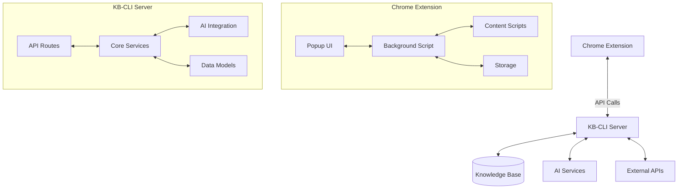

# KB-CLI Code Structure

## Architecture Overview



## Core Components

### 1. Chrome Extension
- **Popup UI**: User interface for the browser extension
- **Background Script**: Handles background processing and message passing
- **Content Scripts**: Interact with web pages
- **Storage**: Local storage for user data and preferences

### 2. KB-CLI Server
- **API Layer**: Handles HTTP requests from the extension
- **Core Services**: Business logic and data processing
- **AI Integration**: Interfaces with AI models for processing
- **Data Models**: Defines the structure of stored knowledge

## Data Flow

1. User interacts with the Chrome extension
2. Extension sends requests to the KB-CLI server
3. Server processes requests using core services and AI
4. Data is stored/retrieved from the knowledge base
5. Results are returned to the extension for display

## Key Files

```
chrome-extension/
├── manifest.json         # Extension configuration
├── popup/               # Popup UI components
│   ├── popup.html
│   ├── popup.js
│   └── popup.css
├── background/          # Background scripts
│   ├── background.js
│   └── message-handler.js
├── content/            # Content scripts
│   └── content.js
└── lib/                # Shared libraries
    ├── api.js
    └── storage.js

src/
├── server/             # Server-side code
│   ├── index.js        # Server entry point
│   ├── routes/         # API routes
│   └── services/       # Business logic
└── cli/               # Command-line interface
    ├── commands/      # CLI commands
    └── utils/         # Utility functions
```

## Dependencies

### Main Dependencies
- **Frontend**: React, Redux, Webpack
- **Backend**: Node.js, Express, MongoDB
- **AI**: TensorFlow.js, Natural
- **Testing**: Jest, Cypress

## Development Workflow

1. Make changes to the code
2. Run tests: `npm test`
3. Build the extension: `npm run build`
4. Test in browser
5. Create a pull request
