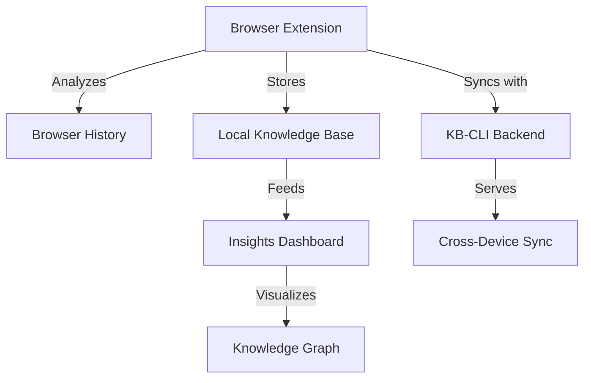

# KB-CLI Chrome Extension Documentation

## Overview
The KB-CLI Chrome Extension enhances your browsing experience by analyzing your web activity and integrating with your personal knowledge base. It automatically identifies patterns, extracts insights, and helps you organize information more effectively.

## Features

### 1. Browser History Analysis
- Tracks and categorizes visited domains
- Extracts keywords from page content
- Identifies browsing patterns and interests
- Generates insights about your web usage

### 2. Knowledge Integration
- Syncs with your local KB-CLI instance
- Maintains a structured knowledge graph
- Links related information across different sources
- Enables powerful search and retrieval

### 3. Privacy-Focused
- All processing happens locally in your browser
- Clear data retention policies
- Granular control over collected data
- No external tracking

## Architecture

## Data Flow

1. **Collection**: Browser history and active tab data is collected
2. **Processing**: Data is analyzed and transformed into structured knowledge
3. **Storage**: Knowledge is stored locally and optionally synced to KB-CLI
4. **Visualization**: Insights are presented in the extension popup
5. **Integration**: Knowledge is made available across your devices via KB-CLI

## Privacy

- All data processing happens locally in your browser
- No personal data is shared with third parties
- You control what gets synced to your KB-CLI instance
- Clear data retention policies
- Open-source and transparent

## Development

### Setup
1. Clone the repository
2. Install dependencies: `npm install`
3. Build the extension: `npm run build`
4. Load unpacked extension in Chrome

### Testing
- Unit tests: `npm test`
- Integration tests: `npm run test:integration`
- Linting: `npm run lint`

## License
MIT License - See [LICENSE](LICENSE) for details
