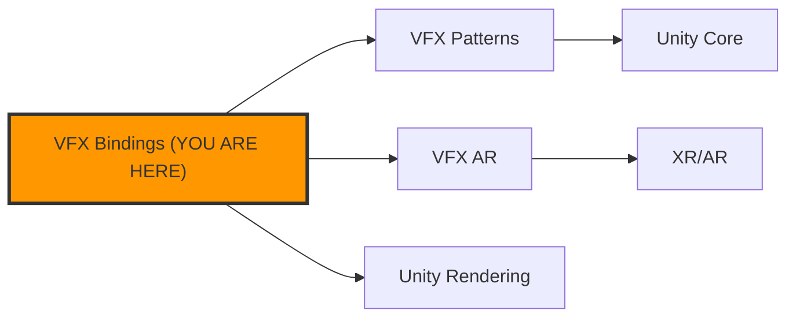

# KB Visualizer - Product Spec

> "We were blind. Now we can see."

**Version:** 1.0 (2026-02-12)
**Status:** Draft
**Scope:** Unified spec for kb-cli + xrai-kg + Chrome Extension + Visualization Stack

---

## Vision

Knowledge is invisible by default. Files sit in folders. Patterns hide in commit histories. Relationships between ideas exist only in the heads of the people who discovered them. AI agents operate on flat text without spatial awareness of the knowledge they navigate.

This spec defines a **visualization-first knowledge system** that makes the invisible visible -- for both humans and AI agents. The goal is not dashboards for dashboards' sake. The goal is **practical tools for empowering users to**:

- Make magic and manifest imagination
- Solve big problems by seeing the whole picture
- Explore and discover connections that text alone conceals
- Learn by navigating knowledge spatially
- Play with ideas in a visual sandbox
- Promote empathy by making other people's knowledge structures visible
- Amplify human expression through visual knowledge artifacts
- Enhance collaborative creativity by giving teams a shared visual workspace

---

## Architecture Overview

```
                    "We were blind, now we can see"
                               |
         +---------------------+---------------------+
         |                     |                      |
    [AI Agents]          [Developers]           [End Users]
    see: Mermaid         see: Interactive        see: 3D/Spatial
    parse: JSON          explore: Graph          feel: Immersive
    act: CLI             edit: Chat              create: Voice/Touch
         |                     |                      |
         +---------------------+---------------------+
                               |
                     +---------+---------+
                     |   XRAI Facade     |
                     |   (xrai-kg npm)   |
                     +---------+---------+
                               |
              +----------------+----------------+
              |                |                |
        [Data Layer]    [Search Layer]    [AI Layer]
        KnowledgeGraph   Fuse.js          ChatParser
        Entity/Relation  Indexing          NL Commands
        Storage          Cache            LLM Hooks
              |                |                |
              +----------------+----------------+
                               |
              +----------------+----------------+
              |                |                |
        [Viz Layer]     [Export Layer]    [Adapter Layer]
        ECharts/GL      Mermaid          Chrome Extension
        Cytoscape       Graphviz/DOT     VS Code
        3D Force        SVG/PNG          CLI (kb-cli)
        Markmap         JSON/CSV         MCP Server
```

---

## Existing Components (What We Have)

| Component | Status | Location | Role |
|-----------|--------|----------|------|
| **xrai-kg** | Implemented | `Vis/xrai-kg/` | Core library: data, search, AI, viz layers |
| **EChartsRenderer** | Implemented | `xrai-kg/src/viz/` | GPU-accelerated graph viz (10K+ nodes) |
| **MermaidExporter** | Implemented | `xrai-kg/src/viz/` | AI-readable diagram export |
| **ChatParser** | Implemented | `xrai-kg/src/ai/` | Natural language graph commands |
| **SearchEngine** | Implemented | `xrai-kg/src/search/` | Fuse.js fuzzy search with cache |
| **XRAI Dashboard** | Production | `Vis/knowledge-graph-xrai-dashboard.html` | 322KB multi-view dashboard |
| **kb-cli** | Working | `kb-cli/kb` | 975-line Python agentic CLI |
| **Chrome Extension** | In Progress | `kb-cli/chrome-extension/` | Browser history + KB integration |
| **KB Diagrams** | Generated | `KnowledgeBase/KB_ARCHITECTURE_DIAGRAMS.md` | 5 Mermaid diagrams, auto-generated |
| **DataViz Patterns** | Documented | `KnowledgeBase/_DATAVIZ_HUB_PATTERNS.md` | ECharts-GL reference patterns |
| **3D Viz Patterns** | Documented | `KnowledgeBase/_3D_VISUALIZATION_KNOWLEDGEBASE.md` | Three.js/WebGL patterns |
| **WebGL Example** | Reference | `KnowledgeBase/CodeSnippets/webgl-3d-visualization-example.html` | 793-line 3D force graph |

---

## Missing Components (What We Need)

### 1. Visualization Pipeline (Backend)

**Purpose:** Auto-generate visual representations of the KB that both AI agents and humans can consume.

```
KnowledgeBase/ (137 .md files)
        |
   [kb-viz-pipeline]  <-- NEW
        |
   +----+----+----+----+
   |         |         |         |
Mermaid   ECharts   Graphviz   Markmap
(.md)     (.html)   (.svg)     (.html)
   |         |         |         |
AI agents  Browser   Reports   Overview
```

**Implementation:**
```bash
# New script: scripts/kb-viz-generate.mjs
# Reads all .md files, extracts:
#   - Front-matter metadata (category, tags, depends_on)
#   - Internal links (references to other KB files)
#   - Code block languages (what tech each doc covers)
#   - Section headers (topic structure)
# Outputs:
#   - kb-graph.json          (source of truth)
#   - KB_MAP.md              (Mermaid, <100 nodes, for GitHub/AI)
#   - KB_EXPLORER.html       (Cytoscape/ECharts, interactive)
#   - KB_OVERVIEW.svg        (Graphviz, static, for reports)
#   - KB_MINDMAP.html        (Markmap, hierarchical overview)
```

**Why multiple outputs:**
- **Mermaid**: AI agents read it directly in context. LLMs are trained on Mermaid syntax. Zero rendering needed.
- **ECharts/Cytoscape**: Humans explore interactively. Click nodes, filter types, search, zoom.
- **Graphviz SVG**: Deterministic, high-quality static output. Embed in docs, share as image.
- **Markmap**: Hierarchical overview from markdown headers. Shows KB structure as a mindmap.

### 2. kb-cli Visualization Commands

**Purpose:** Surface visualizations directly from the CLI.

```bash
# New commands for kb-cli
kb viz                    # Open interactive KB explorer in browser
kb viz --mermaid          # Output Mermaid diagram to stdout (pipe to .md)
kb viz --svg              # Generate and open SVG (via Graphviz)
kb viz --json             # Output graph JSON (for custom tooling)
kb viz --focus "VFX"      # Generate subgraph centered on a topic
kb viz --depth 2          # Limit traversal depth from focus node
kb viz --types Domain     # Filter to specific entity types
kb viz --diff HEAD~5      # Visualize what changed in last 5 commits
kb viz --health           # Visual health check (orphaned docs, dead links)
```

**Integration with existing kb-cli:**
- Add `viz` as a new skill in `kb-cli/skills/`
- Leverage existing `kb_search` skill for focused subgraphs
- Use existing `KnowledgeManager.js` data model as input

### 3. Chrome Extension Visualization Tab

**Purpose:** See your browsing knowledge graph in real-time.

The Chrome extension already has:
- `historyAnalyzer.js` (domain categorization, keyword extraction)
- `knowledgeBase.js` (insight processing, engagement scoring)
- `popup.html` with 3 tabs (Suggestions, Tabs, Interests)

**New: Add a 4th tab -- "Graph"**
- Mini ECharts graph showing browsing topic clusters
- Nodes = topics/domains, edges = co-visited patterns
- Click a node to see related KB entries
- Color by engagement level (from `knowledgeBase.js` scores)
- Sync with kb-cli server to overlay KB structure

### 4. AI Agent Visual Context

**Purpose:** Give AI agents spatial awareness of the knowledge they navigate.

**Problem:** When an AI agent searches the KB, it gets flat text results. It has no sense of:
- Where a document sits in the knowledge topology
- What's nearby (related documents)
- What's upstream/downstream (dependencies)
- How central or peripheral a concept is

**Solution: Mermaid Context Injection**

When an AI agent queries the KB (via MCP server or kb-cli), include a small Mermaid subgraph showing the queried node's neighborhood:

```
Query: "VFX bindings"
Result: _VFX_BINDINGS_MASTER.md (content...)

Context Graph:


This gives the AI agent **spatial context** -- it can "see" related documents and make better decisions about what to read next.

### 5. Collaborative Knowledge Canvas

**Purpose:** Shared visual workspace for teams to build knowledge together.

**Phase 1 (Solo):**
- Interactive graph editor in XRAI Dashboard
- Drag to rearrange nodes
- Double-click to add entities
- Draw edges between nodes
- Auto-save to `kb-graph.json`

**Phase 2 (Collaborative):**
- WebSocket sync for real-time multi-user editing
- Cursor presence (see where others are looking)
- Comment threads on nodes/edges
- Change history with visual diffs

**Phase 3 (Immersive -- Portals Integration):**
- Render KB graph in Unity AR space
- Walk through your knowledge graph in 3D
- Voice commands to navigate: "Show me everything related to VFX"
- Spatial audio cues for node density/importance
- Grab and rearrange nodes with hand tracking

---

## Visualization Technology Stack

### Tier 1: Primary (Use These)

| Tool | Format | Use Case | Scale | AI-Readable |
|------|--------|----------|-------|-------------|
| **Mermaid** | Text -> SVG | Docs, AI context, GitHub | <100 nodes | Best |
| **ECharts-GL** | JSON -> WebGL | Interactive exploration | 10K+ nodes | No (visual only) |

### Tier 2: Specialized (Use When Needed)

| Tool | Format | Use Case | Scale | AI-Readable |
|------|--------|----------|-------|-------------|
| **Graphviz** | DOT -> SVG | Static reports, CI output | <1K nodes | Good (DOT syntax) |
| **Markmap** | Markdown -> SVG | Hierarchical overviews | <200 nodes | Best (is markdown) |
| **Cytoscape.js** | JSON -> Canvas | Graph analysis, algorithms | <10K nodes | No |

### Tier 3: Skip

| Tool | Why Skip |
|------|----------|
| D3.js | Too low-level; ECharts/Cytoscape cover same use cases with less code |
| PlantUML | UML-focused, Mermaid covers same diagram types with better ecosystem |

### Key Patterns (from existing KnowledgeBase)

| Pattern | Source | When |
|---------|--------|------|
| ForceAtlas2 GPU layout | `_DATAVIZ_HUB_PATTERNS.md` | 1000+ nodes |
| GPU tier detection/fallback | `_DATAVIZ_HUB_PATTERNS.md` | Adaptive quality |
| Lazy tab rendering | `_DATAVIZ_HUB_PATTERNS.md` | Multi-view dashboards |
| Safe DOM (XSS prevention) | `_DATAVIZ_HUB_PATTERNS.md` | All user-facing viz |
| ECharts version lock | `_DATAVIZ_HUB_PATTERNS.md` | echarts@5 + echarts-gl@2.0.9 |
| Auto-performance scaling | `xrai-kg/ARCHITECTURE.md` | graph vs graphGL by node count |

---

## Data Model

### Source of Truth: `kb-graph.json`

Generated by `kb-viz-generate.mjs`, consumed by all visualization tools.

```json
{
  "version": "1.0",
  "generated": "2026-02-12T00:00:00Z",
  "stats": { "entities": 150, "relations": 89, "types": 13 },
  "entities": [
    {
      "id": "vfx-bindings-master",
      "name": "VFX Bindings Master",
      "entityType": "Document",
      "category": "VFX Graph",
      "file": "_VFX_BINDINGS_MASTER.md",
      "tags": ["vfx", "bindings", "unity"],
      "size": 4200,
      "lastModified": "2026-02-10",
      "sections": ["Overview", "Binding Patterns", "Troubleshooting"],
      "codeLanguages": ["csharp", "hlsl"],
      "observations": ["Covers VFX Graph property bindings", "Referenced by 3 other docs"]
    }
  ],
  "relations": [
    {
      "from": "vfx-bindings-master",
      "to": "vfx-master-patterns",
      "relationType": "references",
      "weight": 3,
      "evidence": "3 inline links"
    }
  ]
}
```

### Enrichment Sources

| Source | Data | How |
|--------|------|-----|
| File metadata | Size, modified date, language | `fs.stat` + front-matter parse |
| Internal links | Document references | Regex `_[A-Z_]+\.md` patterns |
| Git history | Change frequency, contributors | `git log --format` |
| Chrome extension | Browsing patterns, engagement | `knowledgeBase.js` insights |
| AI agent queries | Access frequency, query patterns | MCP server logs |
| Manual annotations | Importance, status, notes | Front-matter `tags:` field |

---

## Implementation Phases

### Phase 1: Pipeline + CLI (Foundation)

**Deliverables:**
- `scripts/kb-viz-generate.mjs` -- graph extraction pipeline
- `kb-graph.json` -- generated data file
- `KB_MAP.md` -- auto-generated Mermaid (commit to repo)
- `kb viz` command in kb-cli
- Run in `kb-health-check.sh` automation (daily)

**Success criteria:**
- `kb viz --mermaid` outputs valid Mermaid that GitHub renders
- `kb viz` opens interactive graph with all 137 KB files
- AI agents receive Mermaid context with KB search results

### Phase 2: Interactive Explorer + Chrome

**Deliverables:**
- `KB_EXPLORER.html` -- standalone interactive graph (ECharts-GL)
- Chrome extension "Graph" tab with mini knowledge map
- Graphviz SVG export for static reports
- Markmap hierarchical overview

**Success criteria:**
- Explorer loads 137+ nodes in <2s
- Chrome extension shows browsing topic clusters
- `kb viz --svg` produces publishable diagram

### Phase 3: AI Agent Context + Collaboration

**Deliverables:**
- MCP server returns Mermaid neighborhood with search results
- kb-cli `--focus` and `--diff` commands
- Visual health check (orphaned docs, dead links, stale content)
- Real-time collaborative editing (WebSocket sync)

**Success criteria:**
- AI agents make better navigation decisions (measurable via query depth reduction)
- `kb viz --health` identifies 100% of orphaned documents
- Two users can simultaneously edit the knowledge graph

### Phase 4: Immersive (Portals Integration)

**Deliverables:**
- Unity renderer for KB graph (AR space)
- Voice navigation: "show me VFX" zooms to cluster
- Hand tracking for node manipulation
- Spatial audio density cues

**Success criteria:**
- Walk through your knowledge graph in AR
- Voice commands navigate with <2s response
- "Wow, I can SEE my knowledge" reaction from first-time users

---

## The Recursive Architecture

> The KB Visualizer IS Portals applied to its own knowledge.

This is not a metaphor. It is a structural identity. Every capability in the Portals bridge protocol has an exact analog in knowledge graph operations. The same codebase, the same voice pipeline, the same bridge messages power both "build me a scene" and "show me what I know."

### The Bridge Protocol Mapping

Portals has 41 bridge message types across 8 categories. Every one maps to a knowledge operation:

#### Object Operations -> Entity Operations

| Portals Message | Scene Effect | KB Analog | Knowledge Effect |
|----------------|--------------|-----------|-----------------|
| `add_object` | Creates a 3D primitive | `add_entity` | Creates a knowledge node |
| `modify_objects` | Changes color/material/scale | `update_entity` | Changes metadata/tags/weight |
| `remove_object` | Deletes from scene | `remove_entity` | Archives or removes from graph |
| `update_transform` | Position/rotation/scale | `update_layout` | Spatial arrangement in graph |
| `batch_execute` | Multiple ops in one frame | `batch_import` | Bulk knowledge ingestion |

#### Component System -> Property System

| Portals Message | Scene Effect | KB Analog | Knowledge Effect |
|----------------|--------------|-----------|-----------------|
| `add_component(Light)` | Adds light to object | `add_property(importance)` | Marks node as high-signal |
| `add_component(Rigidbody)` | Physics simulation | `add_property(decay)` | Time-based relevance decay |
| `set_property(intensity, 5)` | Adjusts light brightness | `set_property(weight, 0.9)` | Adjusts connection strength |
| `set_property(color, red)` | Visual change | `set_property(category, "urgent")` | Semantic classification |

#### Animation -> Visualization Modes

| Portals Message | Scene Effect | KB Analog | Knowledge Effect |
|----------------|--------------|-----------|-----------------|
| `set_animation(rotate)` | Object spins | `set_viz(pulse)` | Node pulses with activity |
| `set_animation(bounce)` | Object bounces | `set_viz(grow)` | Node grows with new connections |
| `set_animation(float)` | Gentle hover | `set_viz(breathe)` | Ambient "alive" indicator |
| `set_animation(stop)` | Freeze | `set_viz(static)` | Snapshot mode |

#### VFX -> Insight Particles

| Portals Message | Scene Effect | KB Analog | Knowledge Effect |
|----------------|--------------|-----------|-----------------|
| `add_emitter(fire)` | Particle fire | `add_insight(hot_topic)` | Trending knowledge marker |
| `add_emitter(sparkle)` | Sparkle effect | `add_insight(new_connection)` | Recently discovered link |
| `add_emitter(rain)` | Rain particles | `add_insight(data_flow)` | Information flowing between nodes |
| `add_emitter(snow)` | Snow particles | `add_insight(cooling)` | Decaying relevance |

#### Wires -> Live Knowledge Connections

This is the deepest mapping. Portals' wire system connects properties reactively:
`audio.bass -> light.intensity` means "when bass hits, light brightens."

| Portals Wire | Scene Effect | KB Wire | Knowledge Effect |
|-------------|--------------|---------|-----------------|
| `audio.bass -> scale` | Audio-reactive size | `query_freq -> node_size` | Frequently accessed = bigger |
| `audio.treble -> color` | Audio-reactive color | `recency -> color` | Recently modified = brighter |
| `time -> rotation` | Continuous spin | `staleness -> opacity` | Old knowledge fades |
| `proximity -> intensity` | Distance-reactive | `relevance -> focus` | Related nodes sharpen on hover |

#### Vibes -> Focus Modes

| Portals Message | Scene Effect | KB Analog | Knowledge Effect |
|----------------|--------------|-----------|-----------------|
| `set_vibe(sunset)` | Warm lighting | `set_focus(creative)` | Show inspiration/pattern clusters |
| `set_vibe(midnight)` | Dark, minimal | `set_focus(debug)` | Show error patterns, gaps |
| `set_vibe(neon)` | High contrast | `set_focus(priority)` | Highlight critical path only |
| `set_vibe(nature)` | Organic feel | `set_focus(explore)` | Expand all, show everything |
| `set_vibe(galaxy)` | Cosmic scale | `set_focus(zoomed_out)` | Meta-view, domain clusters only |

#### Voice Pipeline -> Knowledge Query Pipeline

The exact same flow:

```
SCENE CREATION:
  Voice -> Whisper -> Gemini (structured IR) -> aiSceneComposer -> bridge -> Unity

KNOWLEDGE NAVIGATION:
  Voice -> Whisper -> Gemini (structured IR) -> aiKnowledgeComposer -> bridge -> Unity
```

| Voice Command (Scene) | Voice Command (Knowledge) |
|----------------------|--------------------------|
| "Add a red cube" | "Show me the VFX cluster" |
| "Make it bigger" | "Expand this topic" |
| "Connect them with a wire" | "How are these related?" |
| "Add sparkles" | "What's new here?" |
| "Set the vibe to sunset" | "Focus on creative patterns" |
| "Remove that" | "Archive this -- it's outdated" |
| "Group these together" | "These belong to the same domain" |
| "Undo" | "Undo" (same) |

### Why This Matters: Seven Compounding Effects

The recursion is not cosmetic. It creates concrete compounding value through seven mechanisms:

**1. The Correctness Oracle**
Using Portals to visualize its own architecture exposes bugs in the spatial rendering by rendering spatial code spatially. If the VFX cluster looks wrong in the knowledge graph, the VFX code itself may have issues. The product tests itself.

**2. The Preference Collapse**
The Portals team IS the first user of the KB Visualizer. The gap between "what we think users want from spatial knowledge" and "what we actually need" is zero. Every improvement to the KB Visualizer is driven by real need, not speculation.

**3. The Improvement Cascade**
Better KB visualization -> developers find patterns faster -> better code -> better bridge protocol -> better KB visualization. Each cycle compounds. This is not linear improvement; it is multiplicative.

**4. The Cognitive Unification**
One mental model for everything. "Add a node" works for scenes AND knowledge. "Connect" works for wires AND relations. "Focus" works for lighting AND filtering. Developers learn one system and can operate in both domains.

**5. The Data Flywheel**
Every interaction with the KB Visualizer generates data:
- Which nodes do developers visit most? (priority signal)
- Which connections do they traverse? (dependency signal)
- What do they search for and not find? (gap signal)
- How do they rearrange the graph? (mental model signal)

This data feeds back to improve the KB itself, the visualization algorithms, and the AI agent's understanding of the codebase.

**6. The Eigenform Convergence**
A recursive product converges to its fixed point -- the stable form where the tool IS the optimal tool for the problem, because it was refined by being used to solve that problem. Mathematically guaranteed by Lawvere's Fixed-Point Theorem for any sufficiently expressive system.

**7. The Autopoietic Boundary**
The KB Visualizer generates its own documentation (KB_MAP.md is auto-generated). It visualizes its own architecture. It tracks its own development in the TODO.md it helps navigate. It is a self-maintaining system that defines and maintains its own boundary -- what Maturana and Varela call autopoiesis.

### Recursion Depth Ladder

Where Portals + KB Visualizer sits today and where it's headed:

| Level | Name | Test | Status |
|-------|------|------|--------|
| 0 | External | Team doesn't use product | -- |
| 1 | Dogfooding | Team uses product daily | **Current** (KB used daily) |
| 2 | Self-Hosting | Product builds/runs itself | **Phase 1** (KB visualizes itself) |
| 3 | Self-Defining | Product's structure IS its data model | **Phase 2** (bridge protocol = graph protocol) |
| 4 | Self-Improving | Output feeds back to improve product | **Phase 3** (usage data -> better AI) |
| 5 | Self-Creating | Product generates novel capabilities | **Phase 4** (AI discovers new patterns from graph structure) |

---

## Intelligence Amplification Patterns

The visualization system is not just for "seeing." Each view mode is designed to amplify a specific cognitive capability:

### 1. Discovery View -- "What don't I know?"

**Purpose:** Surface hidden connections, orphaned knowledge, and blind spots.

**Visualization:**
- Orphaned nodes glow red (no connections = isolated knowledge)
- Thin edges pulse (weak connections = underexplored relationships)
- Cluster gaps highlighted (space between clusters = missing bridges)
- "Dead zones" shaded (areas with no recent activity)

**User empowerment:** You can't explore what you can't see. This view reveals the topology of ignorance -- where the gaps are, where connections should exist but don't.

### 2. Priority View -- "What matters most right now?"

**Purpose:** Focus attention on high-leverage knowledge nodes.

**Visualization:**
- Node size = impact (connections x recency x query frequency)
- Edge thickness = dependency strength
- Color = urgency (red = blocking, yellow = active, green = stable)
- Fade everything below a configurable threshold

**User empowerment:** Information overload is a focus problem, not a quantity problem. This view answers "given everything I know, what should I work on next?" The same `set_vibe(neon)` that creates high-contrast lighting in a scene creates high-contrast focus in knowledge.

### 3. Prediction View -- "What's likely to matter tomorrow?"

**Purpose:** Proactive, predictive goal setting based on knowledge trajectory.

**Visualization:**
- Trend arrows on nodes (growing/shrinking based on recent delta)
- "Heat forecast" showing which clusters are accelerating
- Dependency chains highlighted (if X grows, Y will need attention)
- Timeline scrubber showing knowledge evolution over days/weeks

**Data sources:**
- Git commit frequency per KB file
- AI agent query patterns (what gets asked about more?)
- Chrome extension browsing trends (what topics are being researched?)
- TODO.md task completion velocity per domain

**User empowerment:** Most knowledge systems are reactive -- you search when you need something. This view is proactive. It shows where knowledge demand is heading before you hit the wall.

### 4. Empathy View -- "How does someone else see this?"

**Purpose:** Make other people's knowledge structures visible.

**Visualization:**
- Overlay another person's query history on the graph
- Show which nodes they visit vs. which you visit (divergence = different mental models)
- Highlight shared nodes (common ground) vs. unique nodes (specialized knowledge)
- "Knowledge distance" metric between two people

**User empowerment:** Collaboration fails when people have invisible disagreements about what matters. This view makes mental models visible, enabling faster alignment and genuine empathy for different perspectives.

### 5. Flow View -- "How does knowledge move?"

**Purpose:** Understand information flow patterns across the system.

**Visualization:**
- Animated particles flowing along edges (like Portals wire particles)
- Particle speed = transfer frequency
- Bottleneck detection (high inflow, low outflow = knowledge sinks)
- Source/sink analysis (where does knowledge originate? where does it accumulate?)

**User empowerment:** Knowledge bottlenecks are invisible in file systems. This view shows whether knowledge is flowing freely or stuck in silos. The same particle system that shows audio flowing through a wire shows insights flowing through a knowledge graph.

### 6. Decision View -- "What are my options and tradeoffs?"

**Purpose:** Map decision spaces visually for faster, better choices.

**Visualization:**
- Decision node at center, options as branches
- Each branch shows: dependencies, risks (red edges), prior art (green edges)
- "Weight of evidence" shown as branch thickness
- Counter-arguments shown as opposing edges
- Historical decisions shown as faded precedents

**User empowerment:** Decisions are hard because the option space is invisible. This view externalizes the decision topology so you can see all options, their implications, and their precedents simultaneously.

---

## Relation to Portals V4

This is not a side project. The KB Visualizer is the **meta-layer** of Portals:

- **Portals** lets users create and experience 3D content with voice and gestures
- **KB Visualizer** applies the same spatial paradigm to knowledge itself
- Phase 4 literally renders knowledge in the Portals engine
- The same bridge protocol (`BridgeTarget.cs`) that handles "add a red cube" can handle "show me the VFX cluster"
- The same voice pipeline that handles "make it bigger" can handle "zoom into AR Foundation"

The KB Visualizer is Portals applied to its own knowledge. Recursive product-market fit.

And this recursion extends to every user:
- A musician using Portals to create spatial audio scenes can use the same system to visualize their creative process
- A teacher using Portals to build AR lessons can visualize the curriculum as a knowledge graph
- A team using Portals for collaborative design can visualize their shared understanding

**The product doesn't just create spatial experiences. It makes the act of understanding spatial.**

---

## Non-Goals

- Not a general-purpose diagramming tool (use Mermaid/Figma for that)
- Not a note-taking app (the KB is markdown files, not a database)
- Not a replacement for search (visualization augments search, doesn't replace it)
- Not a real-time analytics dashboard (the KB changes daily, not per-second)

---

## Open Questions

1. **Storage backend for collaborative editing** -- Firebase? Supabase? Local-first with CRDTs?
2. **MCP server modifications** -- Should viz generation run inside the MCP server or as a separate pipeline?
3. **Chrome extension performance** -- Can ECharts run in a popup (constrained viewport)?
4. **Mermaid size limits** -- Mermaid breaks at ~100 nodes. How to auto-filter to the most relevant subgraph?

---

## References

- `Vis/xrai-kg/ARCHITECTURE.md` -- 5-layer library architecture
- `Vis/xrai-kg/README.md` -- API reference
- `KnowledgeBase/_DATAVIZ_HUB_PATTERNS.md` -- ECharts-GL patterns
- `KnowledgeBase/_3D_VISUALIZATION_KNOWLEDGEBASE.md` -- WebGL/Three.js patterns
- `KnowledgeBase/KB_ARCHITECTURE_DIAGRAMS.md` -- Current auto-generated diagrams
- `kb-cli/kb` -- Python CLI source
- `kb-cli/chrome-extension/` -- Browser integration
- `Vis/knowledge-graph-xrai-dashboard.html` -- Production dashboard
